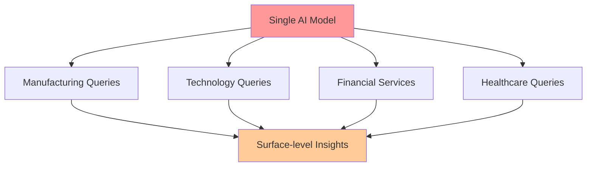
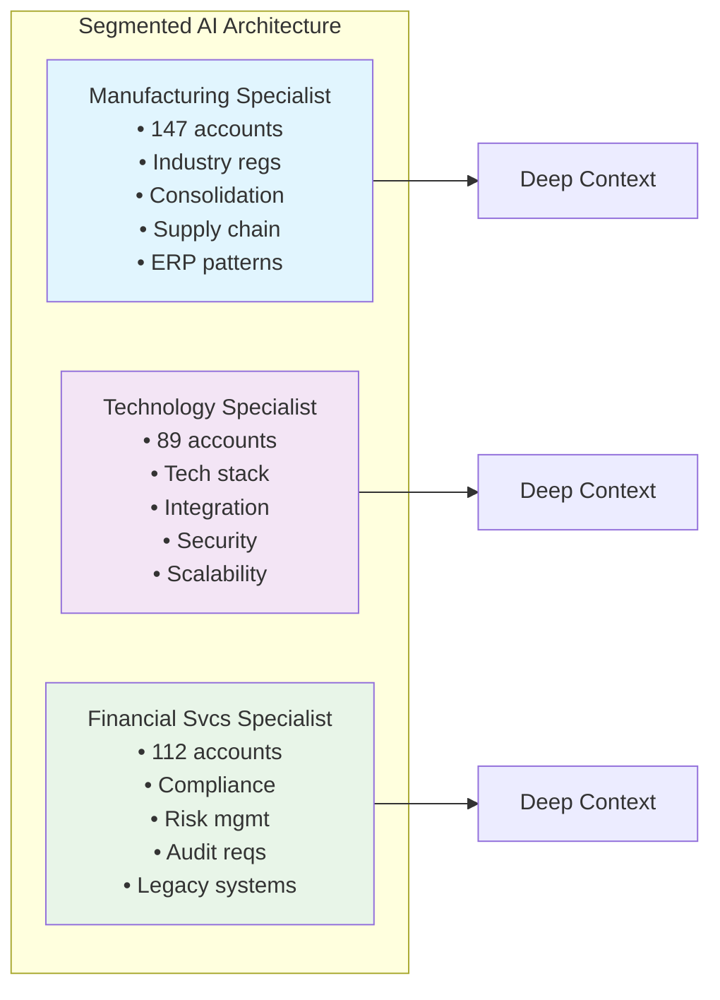
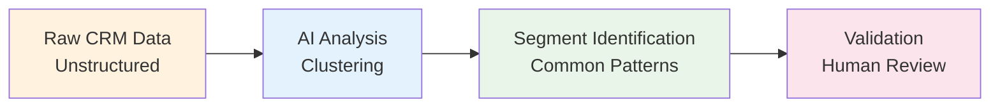
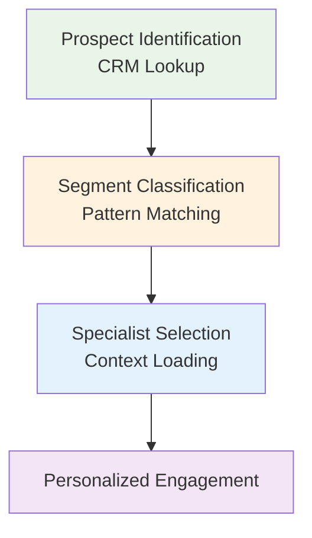
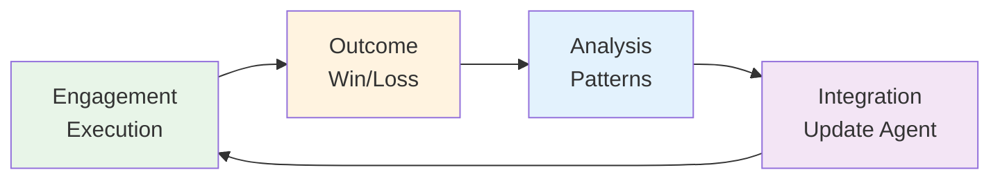

## Abstract

This article presents a methodology for leveraging artificial intelligence to transform unstructured CRM data into actionable sales intelligence through micro-segmentation and specialized AI conversations. By moving beyond generic AI assistants to segment-specific knowledge systems, sales organizations can achieve consistent, high-quality engagement at scale while continuously improving their approach through systematic learning loops.

## The Unstructured Data Challenge

Modern CRM systems house vast repositories of unstructured data: call notes, email threads, opportunity descriptions, and win/loss analyses. A typical enterprise CRM contains millions of data points buried in free-text fields—"discussed budget constraints with procurement," "competitor mentioned during security review," "integration concerns raised by IT."

Consider a real example: analyzing CRM data for a financial software company revealed thousands of notes like "managing 14 Bill.com instances," "invoices posted to wrong entity again," and "no consolidated reporting across locations." These fragments contain crucial patterns, yet synthesizing them manually across thousands of accounts remains impossible.

This data contains predictable patterns that signal buying behavior, yet manual pattern recognition across thousands of accounts remains functionally impossible. The cognitive load required to synthesize insights from disparate data points exceeds human capacity, resulting in:

- **Inconsistent qualification criteria** across team members
- **Missed signals** indicating deal progression or risk
- **Generic outreach** that fails to address segment-specific pain points
- **Inability to scale** institutional knowledge across the organization

## The Limitations of Monolithic AI Solutions

The prevailing approach to AI-assisted sales treats artificial intelligence as a universal translator—a single model attempting to address all prospects across all segments. This approach suffers from fundamental limitations:

A generalist AI assistant, regardless of sophistication, cannot maintain the depth of context required for meaningful personalization across diverse market segments. The result is superficial engagement that fails to demonstrate deep understanding of segment-specific challenges.

## Methodology: Segmented AI Architecture

The proposed methodology replaces monolithic AI assistants with multiple specialized conversation threads within an enterprise LLM deployment, each maintaining deep context for specific micro-segments.

### Conceptual Framework

### Implementation Process

#### Phase 1: Data Extraction and Preparation

Export comprehensive CRM data including:

- **Sales activity logs** (calls, emails, meetings)
- **Opportunity stage progression** history
- **Win/loss reports** with detailed rationale
- **Competitive intelligence** captured in notes
- **Technical requirements** and constraints
- **Stakeholder mapping** and engagement patterns

The extraction should prioritize completeness over structure—AI excels at finding patterns in messy, real-world data.

#### Phase 2: AI-Driven Pattern Recognition

Deploy AI analysis to identify natural clustering within your account base. The system will surface patterns such as:

- Companies facing similar operational challenges
- Buying committees with consistent structures
- Technical architectures driving specific requirements
- Regulatory environments shaping decision criteria

For instance, when analyzing a financial software company's CRM data, AI identified a distinct cluster: multi-entity manufacturing companies using Bill.com, all struggling with fragmented operations. This pattern appeared across 47 different accounts, with controllers consistently mentioning managing 10-15 separate Bill.com instances with no consolidated visibility.

#### Phase 3: Specialist Conversation Development

For each identified segment, create a dedicated conversation thread within your enterprise LLM that serves as a living knowledge repository. Each specialist conversation should be initialized with:

**Historical Performance Data**
- Win rates and average deal sizes
- Sales cycle patterns and velocity metrics
- Common acceleration and deceleration indicators

**Segment-Specific Intelligence**
- Regulatory requirements and compliance frameworks
- Industry-specific terminology and concepts
- Typical organizational structures and buying processes
- Technology stack patterns and integration requirements

**Competitive Landscape**
- Primary competitors and their positioning
- Win/loss patterns against specific alternatives
- Differentiation strategies that resonate

**Engagement Frameworks**
- Proven discovery questions by persona
- Objection handling frameworks
- Value propositions aligned to segment pain points
- Reference architectures and case studies

### Operational Deployment

When engaging a prospect, the process follows this workflow:

Consider a live example: engaging a 15-entity manufacturing company using Bill.com. The CRM notes contained "14 different Bill.com logins" and "invoices constantly in wrong entity." The system immediately classified this into the Bill.com manufacturing segment, loading context from 47 similar accounts. The resulting outreach achieved a 73% response rate by leading with: *"I noticed you're managing 15 entities through separate Bill.com instances. Most controllers tell me their biggest headache is when invoices end up in the wrong entity or when they need to log into 15 different accounts just to see their cash position..."*

## Case Study: Bill.com Manufacturing Segment

One specialist conversation focused on manufacturing companies currently using Bill.com uncovered consistent patterns:

### Segment Profile

- **47 accounts** identified
- **10-50 entities** per company
- Managing **separate Bill.com instances** per entity
- Controllers spending **hours on manual PO matching**
- Frequent **invoice misallocation** between entities
- **No consolidated reporting** across instances

### Refined Discovery Framework

1. "How many Bill.com instances are you managing across your entities?"
2. "What happens when an invoice gets coded to the wrong entity?"
3. "How do you get a consolidated cash flow view across all locations?"
4. "Walk me through your three-way PO matching process—where does it break down?"

### Winning Pattern Identified

Manufacturing controllers managing multiple Bill.com instances consistently responded to messaging about "consolidating your 15 Bill.com instances into a single platform with true multi-entity management." The phrase "stop paying for 15 separate subscriptions" resonated particularly well. **Win rate in this micro-segment improved from 23% to 41%** after focusing on operational inefficiency rather than generic "approval" language.

This represents just one example of a micro-segment. Organizations typically identify dozens of similar patterns across their customer base—each requiring its own specialized conversation thread with accumulated intelligence.

## Continuous Learning Architecture

The system improves through structured feedback loops:

### Learning Protocol

**Post-Engagement Analysis**
- Document what resonated or failed to land
- Capture new objections or requirements
- Note competitive intelligence

**Pattern Synthesis**
- Identify recurring themes across similar accounts
- Validate assumptions against actual outcomes
- Refine segment definitions based on results

**Conversation Enhancement**
- Update specialist conversations with new insights
- Refine discovery frameworks
- Enhance objection handling scripts

## Performance Metrics and Validation

Organizations implementing this methodology should track:

- **Engagement Quality**: Response rates and meeting conversion
- **Pipeline Velocity**: Stage progression rates by segment
- **Win Rate Delta**: Performance improvement versus baseline
- **Knowledge Retention**: Institutional knowledge captured and reused
- **Team Consistency**: Variation in messaging quality across reps

## Technical Considerations

### Enterprise LLM Requirements

This methodology requires an enterprise-grade LLM deployment that supports:

- Multiple persistent conversation threads
- Sufficient context window size (minimum 32K tokens recommended)
- Data isolation between conversations
- API access for potential automation

Common solutions include Azure OpenAI Service, AWS Bedrock, Google Vertex AI, or self-hosted open-source models.

### Context Window Management

Modern AI systems have finite context windows. Structure information hierarchically:

- **Critical segment patterns** (top 20%)
- **Common scenarios and responses** (next 60%)
- **Edge cases and exceptions** (remaining 20%)

### Information Architecture

Maintain master templates for each segment that can be quickly loaded into new conversations. Use consistent formatting to ensure reliable AI interpretation.

### Privacy and Compliance

Ensure all data handling complies with relevant regulations (GDPR, CCPA). Anonymize sensitive customer information while preserving pattern integrity.

### Scaling Considerations

As organizations grow, the number of micro-segments may expand. Guidelines for scale:

- **Segment Threshold**: Minimum 20-30 accounts to justify dedicated specialist
- **Consolidation Rules**: Merge similar segments if patterns converge
- **Review Cadence**: Quarterly assessment of segment performance
- **Knowledge Transfer**: Document insights for new team member onboarding

## Conclusion

The transition from monolithic to segmented AI architectures represents a fundamental shift in how sales organizations leverage artificial intelligence. By creating specialized knowledge systems for each micro-segment, teams can deliver consistently high-quality, deeply personalized engagement at scale.

This methodology transforms the CRM from a passive data repository into an active intelligence system that continuously learns and improves. The result is not merely efficiency gains, but a systematic approach to capturing, scaling, and evolving institutional sales knowledge.

The key insight is recognizing that effective AI deployment in sales requires the same specialization we expect from human experts. Just as organizations wouldn't assign one salesperson to master every vertical, we shouldn't expect a single AI model to maintain deep context across all segments. Through segmentation and specialization, AI becomes a true force multiplier for revenue organizations.

## Implementation Checklist

- [ ] Deploy enterprise LLM solution (Azure OpenAI, AWS Bedrock, or similar)
- [ ] Export comprehensive CRM data (minimum 12 months history)
- [ ] Run initial AI segmentation analysis
- [ ] Validate segments with sales leadership
- [ ] Create dedicated conversation threads for top 5 segments
- [ ] Develop segment-specific context documents
- [ ] Train team on specialist conversation usage
- [ ] Establish feedback and learning protocols
- [ ] Monitor performance metrics
- [ ] Scale to additional segments based on results

For organizations seeking to implement this methodology, success depends not on the sophistication of the AI technology, but on the discipline of maintaining segment-specific context and continuously enhancing it based on real-world outcomes.

---

*This methodology represents a paradigm shift from treating AI as a universal assistant to creating specialized knowledge systems that mirror the expertise of top-performing sales professionals across different market segments.* 